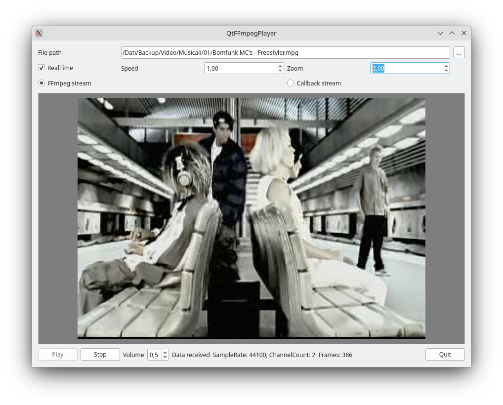

# QtFFmpegPlayer
A Qt movie player based on FFmpeg library

The software permits to play a movie (audio and video) on Linux, Windows, Android and Mac OSX using FFmpeg library.

## Features

- The object QThFFmpegPlayer can be embedded in a Qt application easly.
- More than one signals to have the state of the object, audio and video stream.
- The QIFFmpegPlayerInterface interface provides a differet way to have events about the player.
- Tested with rtsp sources and movies.

